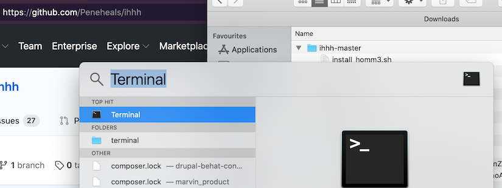
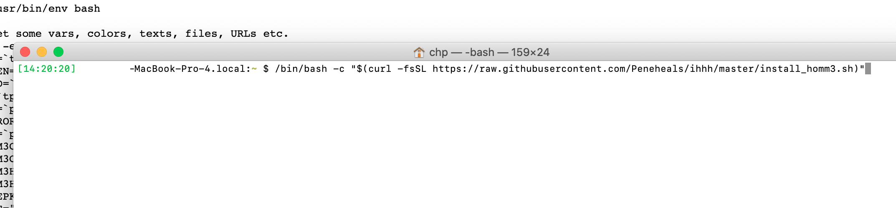
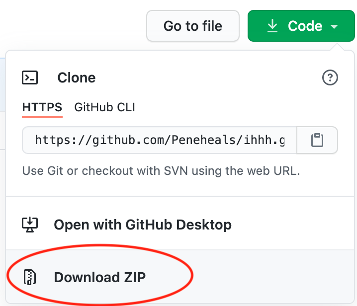
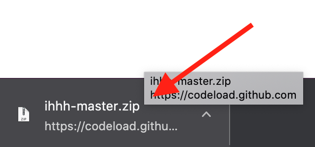
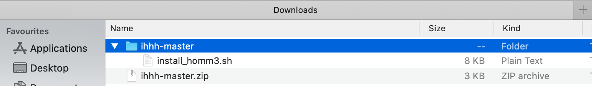
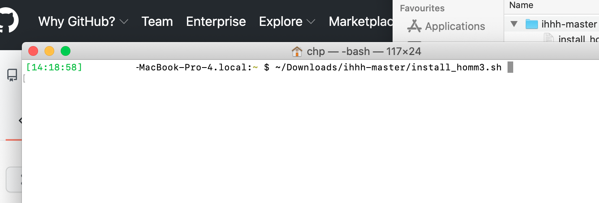

# Mac OS HoMM3 installer

- [Prerequisites](#prerequisites)
- [Install](#install)
- [How to run the game after the install process](#how-to-run-the-game-after-the-install-process)
- [Contribute](#contribute)
- [Good to know](#good-to-know)
- [Alternative install method](#alternative-install-method)
- [Uninstall](#uninstall)
- [Copyright](#copyright)

This short script will help you installing and running Heroes of Might and Magic 3, HoMM3 HD edition and Horn of the Abyss (HotA) on your older Mac OS. You need to do just one thing before you start the process: download the two offline HoMM3 installer files (~1 GB) from [gog.com](https://www.gog.com/account) (I assume you bought the game before).

The whole project's aim is to automatize [this](https://rogulski.it/blog/heroes-3-on-wine/) well-written install guide.

## Prerequisites

- A Macbook with Yosemite, El Capitan, Sierra, High Sierra or Mojave with the latest update. If you are using Catalina or Big Sur, check [this](https://github.com/anton-pavlov/homm3_docker) method insted of this.
- Downloaded HoMM3 offline installer files from gog.com.

## Install

1 - Open the Terminal (hit `Command+Space` -> type `Terminal` and hit `Enter`).

<p align="center">
  <a href="assets/images/open_terminal.png"></a>
</p>

2 - Enter the following command:

```
/bin/bash -c "$(curl -H 'Cache-Control: no-cache' -fsSL https://raw.githubusercontent.com/Peneheals/ihhh/master/install_homm3.sh)"
```

<p align="center">
  <a href="assets/images/curl_run.png"></a>
</p>

## How to run the game after the install process

1. Just open the Terminal (see above how).
1. Enter the below command:

    ```
    cd "$HOME/.wine/drive_c/GOG\ Games/HoMM\ 3\ Complete" && wine HD_Launcher.exe
    ```
1. Check for updates with the "Update" button and install it if you found any!
1. If the basic settings (resolution etc.) look OK, create the HD.exe with the "Create HD exe" button!
1. **Now you are ready to play! The above steps are not necessary in the future, just start the launcher in the Terminal with the above command in step #2 (or push the up key for the last executed commands) and hit the "Play" button!**

## Contribute

If you have any feedback (feature requests, bug reports, problems etc.), feel free to open an issue [here](https://github.com/Peneheals/ihhh/issues/new). Please upload any related screenshots (maybe to [Imgur](https://imgur.com/)) and link them in the issue.

## Good to know

1. The installer uses common and existing tools:
    1. [Brew](https://brew.sh), to install necessary packages.
    1. [Wine](https://www.winehq.org/), to run the Windows-based game in Mac.
    1. [HD mod](https://sites.google.com/site/heroes3hd/eng/download) and [HotA](https://www.vault.acidcave.net/).
    1. Planned: [this](https://github.com/nicohman/wyvern) or [this](https://github.com/Sude-/lgogdownloader) to download the offline installer files from GoG.
1. We do not store nor send any credentials to any 3rd party (except gog.com in a future release).
1. Planned: Linux support!

## Alternative install method

1 - Download the code.

<p align="center">
  <a href="assets/images/download_zip.png"></a>
</p>

2 - Click on it to unzip.

<p align="center">
  <a href="assets/images/open_zip.png"></a>
</p>

3 - Check that it is in the right place (I assume your downloads go to your home's `Downloads` folder).

<p align="center">
  <a href="assets/images/unzipped_zip.png"></a>
</p>

4 - Open the Terminal (hit `Command+Space` -> type `Terminal` and hit `Enter`).

<p align="center">
  <a href="assets/images/open_terminal.png"></a>
</p>

5 - Run the script with `~/Downloads/ihhh-master/install_homm3.sh` command.

<p align="center">
  <a href="assets/images/run_script.png"></a>
</p>

## Uninstall

**Use with precaution! It will wipe everything!!!**
- Brew and all formulas and casks,
- Wine and all your Wine-installed programs,
- HoMM3 and every expansion,
- and all your saved games!

```
curl -H 'Cache-Control: no-cache' -fsSL https://raw.githubusercontent.com/Peneheals/ihhh/master/install_homm3.sh | bash -s -- -u
```
To uninstall just your HoMM3 related stuff (deleting your ~/.wine directory), use this:

```
curl -H 'Cache-Control: no-cache' -fsSL https://raw.githubusercontent.com/Peneheals/ihhh/master/install_homm3.sh | bash -s -- -uh3
```

## Copyright

TODO
