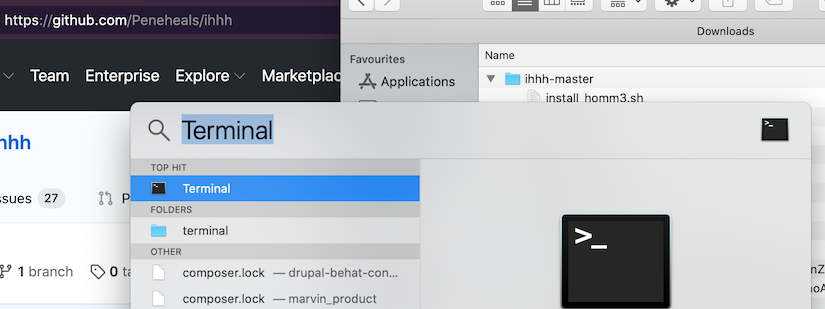
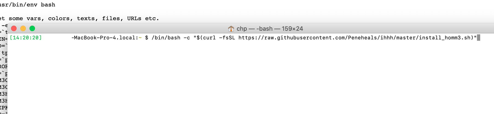
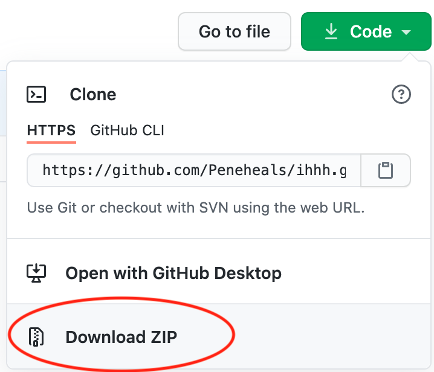
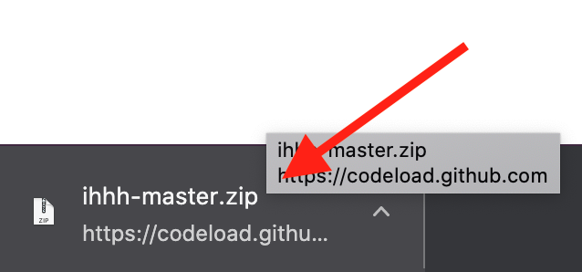
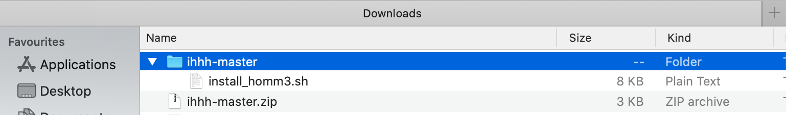
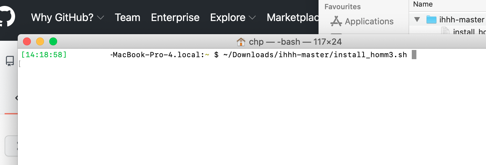

## HoMM3 installer

This short script will help you installing and running Heroes of Might and Magic 3, HoMM3 HD edition and Horn of the Abyss (HotA) on your Macbook. You need to do just one thing before you start the process: download the two offline HoMM3 installer files (~1 GB) from [gog.com](https://www.gog.com/account) (I assume you bought the game before).

The whole project's aim is to automatize [this](https://rogulski.it/blog/heroes-3-on-wine/) well-written install guide.

### Prerequisites

- A Macbook with Yosemite, El Capitan, Sierra, High Sierra or Mojave.
- Downloaded HoMM3 offline installer files from gog.com, so I also assume that you bought the game.

### Install

1 - Open a Terminal (hit `Command+Space` -> type `Terminal` and hit `Enter`).

2 - Enter the following command: `/bin/bash -c "$(curl -fsSL https://raw.githubusercontent.com/Peneheals/ihhh/master/install_homm3.sh)"`

### Alternative install

1 - Download the code.

2 - Clock on it to unzip.

3 - Check that it is in the right place (I assume your DLs go to your home's `Downloads` folder).

4 - Open a Terminal (hit `Command+Space` -> type `Terminal` and hit `Enter`).
    

5 - Run the script.

### Uninstall

TODO

### Run the game after the first install

1. Just open a Terminal (see above how).
2. Enter `cd "$HOME/.wine/drive_c/GOG\ Games/HoMM\ 3\ Complete" && wine HD_Launcher.exe`

### Contribute

If you have any feedback (feature requests, bug reports, problems etc.), feel free to open an issue [here](https://github.com/Peneheals/ihhh/issues/new). Please upload any related screenshots (maybe to [Imgur](https://imgur.com/)) and link them in the issue.

### Good to know

1. The installer uses as much common and existing tools as it can:
  - [Brew](https://brew.sh), to install necessary packages.
  - [Wine](https://www.winehq.org/), to run the Windows-based game in Mac.
  - [HD mod](https://sites.google.com/site/heroes3hd/eng/download) and [HotA](https://www.vault.acidcave.net/).
  - TODO: [this](https://github.com/nicohman/wyvern) or [this](https://github.com/Sude-/lgogdownloader) to download the offline installer files from GoG.
1. Linux support is coming!
1. We do not store nor send any credentials to any 3rd party.

### Copyright

TODO